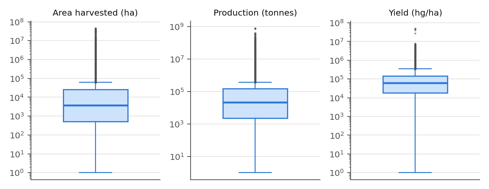

# Oppgave 1 – Datautforskning

> Norsk arbeidsversjon. Den innleverte engelske teksten står i [`main.tex`](main.tex) (Data Exploration).
> Kode: `src/1_datautforskning.py`. Beskriver `crop1_trimmed.csv`, altså dataene *før* oppgave 2.

**1a.** Datasettet har 98 101 rader og seks kolonner, der hver rad er ett land (`Area`), én vekst (`Item`) og ett år (`Year`, 2010–2020) med høstet areal, produksjon og avling (Tabell 2). `Area` og `Item` er kategoriske tekstkolonner, og de tre målingene er flyttall. `Year` er et heltall som vi behandler som numerisk, fordi årene er ordnet med like avstander (Tabell 3). De tre målingene er ikke uavhengige, siden avling er produksjon delt på areal, skalert til hg/ha. Datasettet inneholder derfor to uavhengige størrelser, og det preger hvert senere steg. Alle målingene er sterkt høyreskjeve: gjennomsnittlig produksjon er over 50 ganger medianen, og standardavviket er større enn gjennomsnittet (Tabell 4).

**1b.** *Manglende verdier.* Bare målingene har manglende verdier: 7,3 % i areal, 5,9 % i produksjon og 9,6 % i avling (Tabell 3). I 5 622 rader mangler alle tre, og det finnes ingen duplikater. (Figuren med manglende verdier er tatt ut av rapporten, fordi den gjentok Tabell 3 og kostet ord.)

*Outliers.* Maksimumsverdiene ligger langt over tredje kvartil, for produksjon 5 360 ganger Q3 (Figur 2). IQR-regelen brukt per vekst flagger 13–14 % av verdiene for areal og produksjon og 4,5 % av avlingene. De største verdiene er likevel reelle, for eksempel Indias rismarker (45 millioner ha), Brasils sukkerrør (769 millioner tonn) og nederlandsk innendørs sopp (5 085 tonn/ha). Mange flaggede verdier er altså trolig ekte variasjon i landstørrelse og produksjonsform, ikke målefeil. Areal og produksjon har også over 2 100 nuller hver. Disse nullene håndteres i **oppgave 2**, der de viser seg å markere vekster som ikke ble dyrket.

*Kategoriske kolonner.* `Area` har 200 land og `Item` 118 vekster, men antall rader per kategori varierer fra 11 (Færøyene, talgtrefrø) til 1 298 (`China, mainland`, ikke «China», som ble fjernet som aggregat). 13 av vekstene er sekkekategorier («nes», not elsewhere specified) med 12 944 rader. Radene utgjør dessuten 9 421 tidsserier per land og vekst med inntil 11 år hver, en struktur vi kommer tilbake til i oppgave 2 og 5. Det høye antallet kategorier påvirker valget av encoding i oppgave 4.

**Tabell 2: De fem første radene.**

| Area | Item | Year | area_harvested_ha | production_tonnes | yield_hg_per_ha |
|---|---|---|---|---|---|
| Afghanistan | Almonds, with shell | 2010 | 11 210 | 56 000 | 49 955 |
| Afghanistan | Almonds, with shell | 2011 | 13 469 | 60 611 | 45 000 |
| Afghanistan | Almonds, with shell | 2012 | 13 490 | 62 000 | 45 960 |
| Afghanistan | Almonds, with shell | 2013 | 14 114 | 42 215 | 29 910 |
| Afghanistan | Almonds, with shell | 2014 | 13 703 | 27 400 | 19 996 |

**Tabell 3: Datatype, manglende og unike verdier per kolonne.**

| Kolonne | Datatype | Manglende | Manglende (%) | Unike |
|---|---|---|---|---|
| Area | tekst (str) | 0 | 0,0 | 200 |
| Item | tekst (str) | 0 | 0,0 | 118 |
| Year | heltall (int64) | 0 | 0,0 | 11 |
| area_harvested_ha | flyttall (float64) | 7 172 | 7,3 | – |
| production_tonnes | flyttall (float64) | 5 758 | 5,9 | – |
| yield_hg_per_ha | flyttall (float64) | 9 448 | 9,6 | – |

**Tabell 4: Oppsummerende statistikk for de numeriske kolonnene.**

| | Antall | Gj.snitt | Std.avvik | Min | 25 % | Median | 75 % | Maks |
|---|---|---|---|---|---|---|---|---|
| Year | 98 101 | 2 015 | 3 | 2 010 | 2 012 | 2 015 | 2 018 | 2 020 |
| area_harvested_ha | 90 929 | 161 389 | 1 312 123 | 0 | 418 | 3 394 | 24 009 | 45 000 000 |
| production_tonnes | 92 343 | 1 025 476 | 11 853 360 | 0 | 1 825 | 19 067 | 143 400 | 768 594 154 |
| yield_hg_per_ha | 88 653 | 133 757 | 602 735 | 0 | 18 586 | 58 692 | 148 797 | 50 847 458 |

**Figur 1 (rapportens Figure 1):** Boksplott på log-skala med værhår ved 1,5 × IQR. Nuller (2 179 i areal, 2 132 i produksjon, 30 i avling) kan ikke vises på log-skala og er utelatt.
