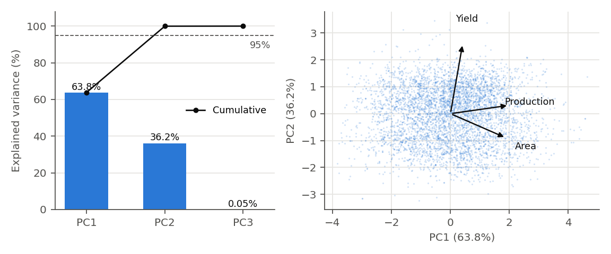

# Oppgave 6 – Dimensjonsreduksjon med PCA (bonus)

> Norsk arbeidsversjon – den engelske teksten skrives i Overleaf-rapporten. Kode: `src/6_pca.py` (skriver ut alle tall og lager Figur 4). Ca. 340 ord inkl. tabell- og figurtekst.

*Metode.* Vi valgte PCA fremfor LDA fordi datasettet ikke har klasser. PCA er unsupervised og finner retningene med størst varians, mens LDA krever klasseetiketter. PCA er også lineær. Vi brukte derfor de log-transformerte og standardiserte målingene fra oppgave 3 og 4b, der avling = produksjon × 10 000 / areal blir en tilnærmet lineær sammenheng: log(avling) ≈ log(produksjon) − log(areal) + 4. Bare de tre målingene er med. `Area` og `Item` er label-koder uten meningsfull avstand, og `Year` er ikke skalert. Dataene ble sentrert i 4b, og PCA ble tilpasset på treningssettet og brukt uendret på testsettet, som skaleringen.

*Resultat.* Areal og produksjon er sterkt korrelert (r = 0,89). De to første komponentene forklarer 99,95 % av variansen (Tabell 7), så vi beholdt to komponenter etter kravet om minst 95 %. Kaiser-kriteriet (egenverdi > 1) gir det samme. PC1 vekter areal og produksjon og beskriver hvor stor dyrkingen er, mens PC2 domineres av avling og beskriver produktiviteten (Figur 4). PC3 er kombinasjonen produksjon − areal − avling, altså selve sammenhengen mellom målingene, og har nesten ingen varians. Den er ikke null fordi log10(x+1) og cappingen per kolonne i oppgave 3 bryter sammenhengen litt.

*Effekt på datasettet.* Datasettet går fra tre til to numeriske kolonner, og komponentene er ukorrelerte. Rekonstrueres målingene fra de to komponentene, er feilen 0,05 % av variansen i treningssettet og 0,06 % i testsettet, så nesten ingen informasjon går tapt, og projeksjonen holder på usette data. Gevinsten er likevel liten. Å bare fjerne avling, som nesten kan regnes ut fra de to andre målingene (R² = 0,98), gir et tap på 0,5–0,6 % og beholder kolonner som er lette å tolke. PCA viser dermed at datasettet inneholder én overflødig måling, men med bare tre målinger koster komponentene mer i tolkbarhet enn de sparer.

**Tabell 7: Egenverdier, forklart varians og egenvektorer (tilpasset på treningssettet).**

| Komponent | Egenverdi | Forklart varians (%) | Kumulativ (%) | Areal | Produksjon | Avling |
|---|---:|---:|---:|---:|---:|---:|
| PC1 | 1,914 | 63,79 | 63,79 | 0,680 | 0,718 | 0,150 |
| PC2 | 1,085 | 36,16 | 99,95 | −0,325 | 0,112 | 0,939 |
| PC3 | 0,001 | 0,05 | 100,00 | −0,657 | 0,687 | −0,309 |

**Figur 4:** Venstre: forklart varians per komponent med kumulativ andel og 95 %-grensen. Høyre: PC1 mot PC2 for 5 000 tilfeldige rader fra treningssettet, med egenvektorene til de tre målingene som piler.
