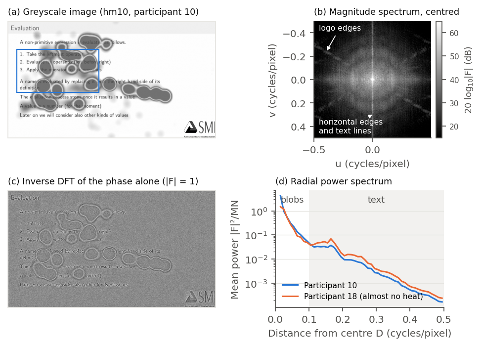
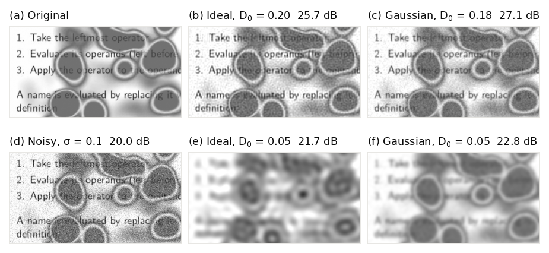
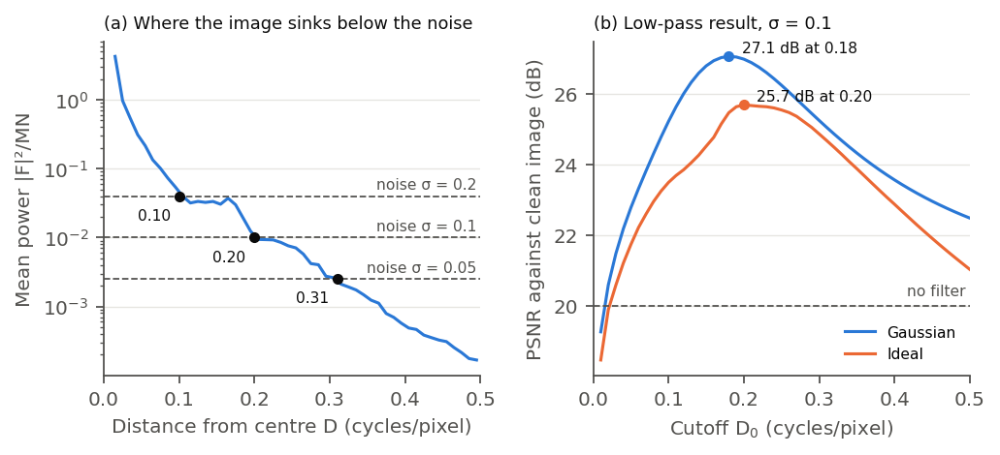
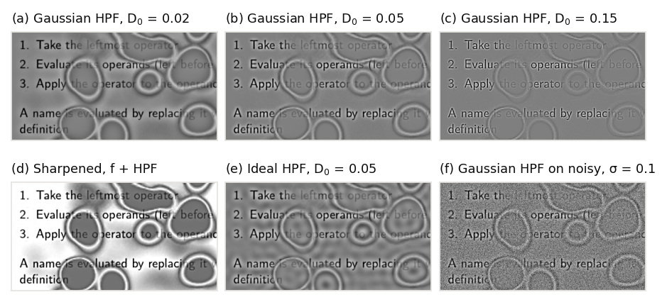
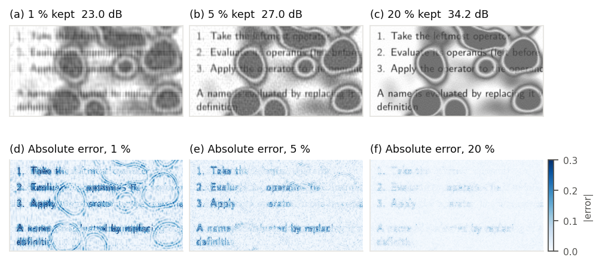
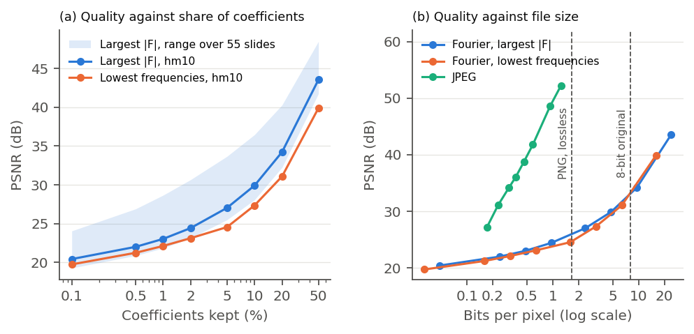

# Fourier-transformasjon (20 poeng)

> Norsk arbeidsversjon. Koden er `src/1_fourier.py`, og alle tall under kommer fra utskriften til
> skriptet. Figurene ligger i `figurer/fourier1_spektrum.png` til `figurer/fourier6_kompresjon_kurver.png`.

*Bilde og oppsett.* Eksempelbildet er lysbilde hm10 («Evaluation») fra deltaker 10. Det har mye tekst, en grå tittellinje, SMI-logoen og mange separate varmeflekker, så både skarpe og myke strukturer er med. Vi leser bildet som gråtone med PIL (luma L = 0,299 R + 0,587 G + 0,114 B) og skalerer det til [0, 1]. Gråtonen gjør den røde kjernen i hver flekk til en flat mørkegrå skive med en lys kant fra den gule delen av fargeskalaen (se fallgruvene i `README.md`). Den skarpe kanten får betydning i alle fire deloppgavene. Vi bruker `scipy.fft` som i forelesningen, bare i 2D (`fft2`, `ifft2`, `fftshift` og `fftfreq`). Frekvenser oppgis i sykler per piksel, og en frekvens D svarer til en periode på 1/D piksler. Den høyeste frekvensen langs hver akse er 0,5 (Nyquist).

## 1 DFT og frekvensspekter

*Metode.* DFT-en skriver bildet som en sum av 2D-sinusbølger. Koeffisienten F(u, v) hører til en bølge med frekvens D = √(u² + v²) og retning gitt av (u, v), og som i forelesningen har hver koeffisient en magnitude |F| og en fase. Bildet på 960 × 540 piksler gir 518 400 komplekse koeffisienter. Vi viser magnituden sentrert med `fftshift`, slik at DC-leddet ligger i midten og frekvensen øker utover. Magnituden spenner fra 113 dB i DC til en median på 22 dB, så vi viser 20·log10|F| og klipper til 15–65 dB, samme grep som forelesningen bruker i STFT-eksempelet. Invers DFT gir originalen tilbake med største avvik 1,2 · 10⁻¹⁵, så transformasjonen mister ingen informasjon.

*Hva spekteret viser (Figur 1b).* Det lyse punktet i midten er DC-leddet. F(0, 0)/MN = 0,877 er middelverdien i bildet, og dette ene leddet har 95,1 % av energien, fordi lysbildet er nesten hvitt. Resten av energien ligger også nær sentrum. 64 % av den ligger innenfor 0,01 sykler per piksel, altså i strukturer større enn 100 piksler, og 89,5 % innenfor 0,10, som bare er 3,1 % av koeffisientene (Tabell 1). Den lyse vertikale linjen gjennom sentrum kommer fra horisontale strukturer. Nederkanten av tittellinjen og tekstlinjene endrer seg bare i vertikal retning, og en rett kant gir en linje i spekteret vinkelrett på kanten. Linjen har 8,9 % av effekten over 0,02 sykler per piksel, men bare 0,1 % av koeffisientene. De svake diagonale linjene i hjørnene kommer fra de skrå kantene i SMI-logoen. Når vi maler over logoen, faller effekten langs disse retningene fra 1 574 til 999.

*Kanteffekter og Hann-vindu.* DFT-en behandler bildet som periodisk, så høyre kant møter venstre og øverste rad møter nederste. Øverste rad har snittverdi 0,81 og nederste 0,97, mens venstre og høyre kolonne begge har 0,99. Hoppet mellom topp og bunn kan gi en kunstig vertikal linje i spekteret, det samme problemet som forelesningen løser med et halvcosinusvindu i STFT. Med et 2D Hann-vindu (`np.hanning` i begge retninger) faller andelen i linjen bare fra 8,9 % til 7,6 %. Linjen er altså i hovedsak ekte innhold, fordi lysbildet har hvit ramme nesten hele veien rundt. Vi viser derfor spekteret uten vindu, og filtrene i deloppgave 2 og 3 bruker heller ikke vindu, siden vinduet ville endret selve bildet.

*Tekst og varme i spekteret (Figur 1d).* Deltaker 18 så nesten ikke på dette lysbildet (0,7 % fargede piksler mot 21,4 % for deltaker 10), så bildet til deltaker 18 er nesten det rene lysbildet. Forskjellen mellom de to radielle spektrene viser hva varmelaget gjør med frekvensinnholdet. Under 0,10 sykler per piksel (perioder over 10 piksler) har bildet med varme 1,70 ganger så mye effekt, fordi flekkene er store, glatte områder. Over 0,10 har det bare 0,67 ganger så mye, fordi det halvgjennomsiktige varmelaget demper kontrasten i teksten under. Teksten gir en tydelig topp rundt 0,16 sykler per piksel (perioder rundt 6 piksler), og toppen er sterkest i bildet uten varme. Varmelaget flytter altså effekt fra høye til lave frekvenser, og det er dette skillet ved rundt 0,10 som lavpass- og høypassfiltrene utnytter.

*Magnitude og fase (Figur 1c).* Magnitudespekteret forteller hvor mye bildet har av hver frekvens, men ikke hvor i bildet den ligger. Den informasjonen ligger i fasen. Setter vi alle magnitudene til 1 og beholder fasen, kommer tekst, logo og kantene rundt flekkene tilbake (r = 0,24 mot originalen). Beholder vi magnituden og setter fasen til 0, blir resultatet en lys flekk rundt origo uten likhet med originalen (r = 0,04). Filtrene i deloppgave 2 og 3 er reelle og symmetriske, H(u, v) = H(−u, −v), så de endrer bare magnituden og lar fasen være. Derfor flytter ingen kanter eller flekker seg når vi filtrerer.

**Tabell 1: Andel av energien (DC holdt utenfor) innenfor en gitt avstand fra sentrum.**

| Radius D (sykler/piksel) | Periode (piksler) | Andel av koeffisientene | Andel av AC-energien |
|---:|---:|---:|---:|
| 0,01 | 100 | 0,03 % | 64,1 % |
| 0,02 | 50 | 0,12 % | 74,2 % |
| 0,05 | 20 | 0,78 % | 83,3 % |
| 0,10 | 10 | 3,14 % | 89,5 % |
| 0,20 | 5 | 12,56 % | 96,4 % |
| 0,30 | 3 | 28,27 % | 99,0 % |

**Figur 1.** (a) Eksempelbildet i gråtone, med utsnittet fra Figur 2, 4 og 5 markert i blått. (b) Sentrert magnitudespekter i dB, klippet til 15–65 dB, så DC-leddet (113 dB) er utenfor skalaen. (c) Invers DFT av fasen alene, med alle magnituder satt til 1. (d) Gjennomsnittlig effekt per ring rundt sentrum for deltaker 10 og for deltaker 18, som nesten ikke har varme på samme lysbilde.

## 2 Lavpassfilter mot støy

*Metode.* Heatmapene har nesten ingen støy selv, så vi legger til hvit gaussisk støy (σ = 0,1 på skalaen [0, 1], fast frø) og bruker originalen som fasit. Da kan resultatet måles med PSNR = 10·log10(1/MSE) mot originalen. Dette er 2D-versjonen av eksempelet i forelesningen, der en tone på 400 Hz blandes med en støytone på 4 000 Hz. Forskjellen er at hvit støy ikke ligger på én frekvens, men er jevnt fordelt over hele frekvensplanet, så den kan ikke fjernes uten å ta noe av bildet med. Vi har implementert to lavpassfiltre, der spekteret ganges med H(u, v) før invers DFT. Det ideelle filteret har H = 1 for D ≤ D0 og 0 ellers, og det gaussiske har H = exp(−D²/2D0²). Vi prøvde alle grenser D0 fra 0,01 til 0,50 i steg på 0,01. MSE regnes rett fra spektrene med Parsevals teorem, så sveipet trenger ingen invers DFT.

*Resultat (Figur 2 og 3b).* Med σ = 0,1 har det støyete bildet 20,0 dB. Beste ideelle filter (D0 = 0,20) gir 25,7 dB, og beste gaussiske filter (D0 = 0,18) gir 27,1 dB, altså en femtedel av den opprinnelige feilen. Teksten er fortsatt lesbar, men mykere, og flekkene ser uendret ut (Figur 2b og 2c). Det ideelle filteret gir svake ringer rundt skarpe kanter, fordi den bratte kanten i H svarer til en sinc-funksjon i bildet, som svinger. Det gaussiske filteret har ingen ringing, fordi en gaussisk funksjon også er gaussisk i bildeplanet. Det er derfor 1,4 dB bedre.

*Hvorfor den beste grensen havner der den gjør (Figur 3a).* Hvit støy med varians σ² har forventet effekt σ² ved alle frekvenser, mens bildets effekt faller utover. Den beste ideelle grensen er nøyaktig frekvensen der bildets effekt faller under støyeffekten, for alle tre støynivåene (Tabell 2). Innenfor denne frekvensen har hver koeffisient mer bilde enn støy og bør beholdes, og utenfor har den mer støy enn bilde og bør fjernes. Mer støy flytter derfor grensen innover, fra 0,31 ved σ = 0,05 til 0,10 ved σ = 0,2. Vi kontrollerte regelen på deltaker 10 i alle 55 lysbildene med σ = 0,1. Den traff i 51 av 55, og i de fire andre bommet den med høyst 0,03. Beste grense var 0,14 for lysbildene med lite tekst (blant annet «Example» i hm15, hm28 og hm29) og 0,26 for de tekstrike (blant annet «The substitution model» i hm36, hm41 og hm42). Én fast grense passer altså ikke for alle bildene. hm11 og hm14 viser samme lysbilde som hm10, men deltaker 10 har mindre varme der (13 og 15 % fargede piksler mot 21 %), og beste grense er 0,26 mot 0,20. Det stemmer med deloppgave 1, der varmelaget dempet de høye frekvensene i teksten.

*For lav grense (Figur 2e og 2f).* Med D0 = 0,05 forsvinner teksten, mens flekkene fortsatt er tydelige. Det viser skalaskillet fra deloppgave 1, der flekkene ligger under grensen og teksten over. For en som analyserer blikkdata kan dette være nyttig, fordi et kraftig lavpassfilter fjerner mye av lysbildet og beholder hvor studentene så. PSNR faller likevel til 21,7 og 22,8 dB, fordi teksten er en del av fasiten. Det ideelle filteret gir her tydelige ringer inne i flekkene (Figur 2e).

*Kobling til forelesningen.* Et gaussisk lavpassfilter i frekvensplanet er det samme som gaussisk blur i bildeplanet (konvolusjonsteoremet). D0 = 0,05 tilsvarer blur med σ = 1/(2π · 0,05) = 3,2 piksler, og resultatet er likt `scipy.ndimage.gaussian_filter` med største avvik 2,8 · 10⁻⁵. Dette er steget Canny-detektoren i forelesningen starter med, der en 5 × 5 gaussisk kjerne fjerner støy. Fordelen med frekvensplanet er at vi ser nøyaktig hvilke frekvenser som fjernes, og at regnetiden er den samme uansett hvor stor kjernen er.

**Tabell 2: Beste grense D0 og PSNR mot originalen for tre støynivåer.**

| σ | Støyete | Ideelt filter | Gaussisk filter | Bildets effekt < σ² fra |
|---:|---:|---:|---:|---:|
| 0,05 | 26,0 dB | 0,31 (29,5 dB) | 0,26 (30,5 dB) | 0,31 |
| 0,10 | 20,0 dB | 0,20 (25,7 dB) | 0,18 (27,1 dB) | 0,20 |
| 0,20 | 14,0 dB | 0,10 (22,7 dB) | 0,12 (24,1 dB) | 0,10 |

**Figur 2.** Lavpassfiltrering av det støyete bildet (σ = 0,1) på utsnittet markert i Figur 1a. Øverste rad viser originalen og beste grense for hvert filter, og nederste rad viser det støyete bildet og en for lav grense (D0 = 0,05). PSNR er målt mot originalen på hele bildet.

**Figur 3.** (a) Radielt effektspekter for originalen med støyeffekten σ² for tre støynivåer. Punktene viser hvor bildet faller under støyen, som er den beste ideelle grensen i Tabell 2. (b) PSNR mot grensen D0 for σ = 0,1, der den stiplede linjen er det ufiltrerte støyete bildet.

## 3 Høypassfilter for kanter

*Metode.* Høypassfilteret er komplementet til det gaussiske lavpassfilteret, H = 1 − exp(−D²/2D0²), og vi prøvde D0 = 0,02, 0,05 og 0,15. Til sammenligning har vi også et ideelt høypassfilter med D0 = 0,05. Siden H(0, 0) = 0, fjernes DC-leddet, og middelverdien i resultatet blir 0. Resultatet har derfor både positive og negative verdier, og vi viser 0 som midtgrått. For å forsterke kantene i selve bildet legger vi høypassresultatet til originalen, f + k · HPF(f) med k = 1, som kalles skjerping eller high-boost.

*Resultat (Figur 4a–4c).* Flate områder forsvinner, både den hvite bakgrunnen, fyllet i tittellinjen og den mørkegrå kjernen i flekkene. Tilbake står teksten og kantene rundt flekkene. Flekkene blir altså ikke borte, men blir til ringer, fordi gråtonekonverteringen gir dem en skarp lys kant. Grensen bestemmer hvor store strukturer som fjernes. Med D0 = 0,02 er flekkene fortsatt litt mørke inni, og teksten står kraftig fram (Figur 4a). Med 0,05 er kjernen i flekkene borte (4b). Med 0,15 er bare de tynneste strekene igjen, og filteret beholder bare 3,5 % av energien utenom DC (4c). Teksten under varmelaget står etter filteret på samme grå bakgrunn som resten, fordi den glatte fargen er fjernet, men den er fortsatt svakere, fordi fargelaget har tatt en del av kontrasten.

*Skjerping (Figur 4d).* I det skjerpede bildet blir teksten mørkere og skarpere, men rundt flekkene oppstår tydelige lyse og mørke haloer. Verdiene går fra −0,75 til 1,50 før de klippes til [0, 1]. Skjerping forsterker alle kanter like mye, også kantene i varmelaget, som ikke hører til lysbildet.

*Ideelt filter og støy (Figur 4e og 4f).* Det ideelle høypassfilteret gir ringer inne i flekkene og ut fra kantene, samme ringing som i deloppgave 2. På det støyete bildet fra deloppgave 2 drukner kantene i støy (Figur 4f). Grunnen er at bildets energi ligger ved lave frekvenser, mens støyen er jevnt fordelt. Før filteret er effekten i bildet 6,0 dB over støyen, og etter et høypassfilter med D0 = 0,05 er den 2,8 dB under. Med D0 = 0,15 er den 7,6 dB under. Et høypassfilter forsterker altså støyen i forhold til bildet, og det er grunnen til at Canny glatter bildet før gradienten regnes ut, og at Sobel-kjernen glatter på tvers av retningen den deriverer i. Et lavpassfilter og et høypassfilter etter hverandre gir et båndpassfilter, som er idéen bak Difference of Gaussians i forelesningen.

**Figur 4.** Høypassfiltrering på samme utsnitt. Panel a, b, c, e og f er skalert symmetrisk rundt 0, som vises som midtgrått. Panel d er originalen pluss høypassresultatet med D0 = 0,05, klippet til [0, 1]. Panel f bruker det støyete bildet fra Figur 2d.

## 4 Kompresjon med Fourier-koeffisienter

*Metode.* Vi sorterer koeffisientene etter magnitude, beholder de p % største, setter resten til 0 og transformerer tilbake. Etter Parsevals teorem er feilen lik energien i koeffisientene vi kaster, delt på MN². Å beholde de største gir derfor minst mulig MSE for et gitt antall koeffisienter, og PSNR kan regnes ut før vi rekonstruerer. Skriptet sjekker at den beregnede og den målte PSNR-en er like. Til sammenligning beholder vi like mange koeffisienter nærmest sentrum, altså de laveste frekvensene, som er det samme som et ideelt lavpassfilter.

*Lagring.* Det nominelle kompresjonsforholdet er 100/p, men det overdriver. Koeffisientene er komplekse, og posisjonen til hver må lagres. Fordi bildet er reelt, er spekteret konjugert symmetrisk, F(−u, −v) = F(u, v)*, så de største koeffisientene kommer i par med lik magnitude, og det holder å lagre den ene i hvert par. Vi regner med to float32 for real- og imaginærdelen og en 32-bits posisjon per par, altså 6 byte per beholdt koeffisient, mot 1 byte per piksel i originalen. Lavpassvalget trenger ingen posisjoner, bare radien, og koster 4 byte per koeffisient. Til sammenligning lagret vi samme 8-bits bilde som PNG (tapsfri) og som JPEG med PIL.

*Bildekvalitet (Figur 5 og Tabell 3).* PSNR stiger jevnt med andelen, fra 20,4 dB ved 0,1 % til 43,5 dB ved 50 %. Ved 1 % er flekkene tydelige, mens teksten er uleselig og har horisontale striper (Figur 5a). Ved 5 % er teksten lesbar, men det er ringing rundt bokstavene og kornete støy i den hvite bakgrunnen (5b). Ved 20 % er bildet nesten likt originalen (5c). Feilbildene viser at feilen samler seg i teksten og kantene rundt flekkene, mens det indre av flekkene er gjengitt nesten uten feil allerede ved 1 % (5d–5f). Det er det samme skalaskillet som i deloppgave 1 og 2. Store, glatte flekker trenger få koeffisienter, mens en skarp kant sprer energien sin over mange frekvenser. Å velge de største koeffisientene er 0,7–3,7 dB bedre enn å velge de laveste frekvensene (Figur 6a), fordi mange viktige koeffisienter for tekst og kanter ligger langt fra sentrum, for eksempel langs den vertikale linjen i Figur 1b.

*Kompresjonsforhold (Figur 6b og Tabell 3 og 4).* Ved 5 % er det nominelle forholdet 20:1, men med 6 byte per koeffisient blir det faktiske 3,3:1. Over 16,7 % blir den komprimerte filen større enn originalen, og 20 % gir 0,83:1. Per byte er de to måtene å velge koeffisienter på nesten like gode, fordi lavpassvalget sparer posisjonene. Den tapsfrie PNG-filen er 107 613 byte (4,8:1). Med samme filstørrelse kan Fourier-metoden bare beholde 3,5 % av koeffisientene, som gir 25,8 dB. Vi taper altså kvalitet og får likevel ikke en mindre fil enn med tapsfri lagring. JPEG med kvalitet 5 gir 27,2 dB med 11 051 byte (47:1), og Fourier-metoden trenger 15 ganger så mye plass for samme PSNR. Ved JPEG-kvalitet 20 og over må Fourier-filen være større enn originalen for å nå samme PSNR.

*Hvorfor den globale DFT-en komprimerer dårlig.* Det er tre grunner. Hver basisfunksjon dekker hele bildet, så en koeffisient som mangler, gir striper og ringing over hele bildet, også over den hvite bakgrunnen. Skarpe kanter, som tekst, fordeler energien sin over svært mange frekvenser. Koeffisientene er komplekse og må lagres med posisjon. JPEG løser alle tre ved å bruke en reell cosinustransformasjon (DCT) på blokker på 8 × 8 piksler, slik at feil og kanter holder seg innenfor sin egen blokk, og ved å kvantisere og entropikode koeffisientene i stedet for å lagre dem som flyttall. Lagringsmodellen vår er enkel, og kvantisering og entropikoding ville gjort Fourier-filene mindre, men neppe med en faktor 15–35.

*Variasjon mellom lysbildene (Figur 6a).* Over deltaker 10 i alle 55 lysbildene ga 5 % av koeffisientene fra 25,5 til 33,7 dB, og hm10 ligger nær medianen (27,0 mot 27,2 dB). De tekstrike lysbildene hm42, hm36 og hm41 («The substitution model») komprimerer dårligst, og «Example»-lysbildene hm29, hm28 og hm15, med bare to eller tre korte linjer, komprimerer best. Mengden varme betyr lite (r = 0,15 mellom andelen fargede piksler og PSNR ved 5 %). Det er teksten og ikke varmen som koster koeffisienter.

**Tabell 3: Kompresjon av eksempelbildet. Faktisk forhold bruker 6 byte per beholdt koeffisient mot 1 byte per piksel.**

| Beholdt | Koeffisienter | PSNR, største | PSNR, laveste frekvenser | Nominelt forhold | Byte | Faktisk forhold | Bit per piksel |
|---:|---:|---:|---:|---:|---:|---:|---:|
| 0,1 % | 518 | 20,4 dB | 19,7 dB | 1 000:1 | 3 108 | 167:1 | 0,05 |
| 0,5 % | 2 592 | 22,0 dB | 21,2 dB | 200:1 | 15 552 | 33:1 | 0,24 |
| 1 % | 5 184 | 23,0 dB | 22,1 dB | 100:1 | 31 104 | 17:1 | 0,48 |
| 2 % | 10 368 | 24,4 dB | 23,1 dB | 50:1 | 62 208 | 8,3:1 | 0,96 |
| 5 % | 25 920 | 27,0 dB | 24,6 dB | 20:1 | 155 520 | 3,3:1 | 2,40 |
| 10 % | 51 840 | 29,9 dB | 27,4 dB | 10:1 | 311 040 | 1,7:1 | 4,80 |
| 20 % | 103 680 | 34,2 dB | 31,1 dB | 5:1 | 622 080 | 0,83:1 | 9,60 |
| 50 % | 259 200 | 43,5 dB | 39,9 dB | 2:1 | 1 555 200 | 0,33:1 | 24,00 |

**Tabell 4: PNG og JPEG av samme bilde, og hvor mye plass Fourier-metoden trenger for samme PSNR.**

| Format | Byte | Forhold | Bit per piksel | PSNR | Fourier-metoden trenger |
|---|---:|---:|---:|---:|---:|
| PNG (tapsfri) | 107 613 | 4,8:1 | 1,66 | tapsfri | 25,8 dB med samme størrelse |
| JPEG, kvalitet 5 | 11 051 | 47:1 | 0,17 | 27,2 dB | 161 274 byte (15×) |
| JPEG, kvalitet 10 | 14 918 | 35:1 | 0,23 | 31,1 dB | 386 676 byte (26×) |
| JPEG, kvalitet 50 | 30 039 | 17:1 | 0,46 | 38,8 dB | 1 051 674 byte (35×) |
| JPEG, kvalitet 90 | 60 506 | 8,6:1 | 0,93 | 48,6 dB | 2 052 132 byte (34×) |

**Figur 5.** Rekonstruksjon fra 1, 5 og 20 % av koeffisientene (de med størst magnitude) og absolutt feil mot originalen, på samme utsnitt som i Figur 2.

**Figur 6.** (a) PSNR mot andelen beholdte koeffisienter når vi velger de største (blå) eller de laveste frekvensene (oransje). Det blå feltet viser spredningen over deltaker 10 i alle 55 lysbildene. (b) PSNR mot filstørrelse i bit per piksel med lagringsmodellen i teksten, sammenlignet med JPEG og tapsfri PNG.
